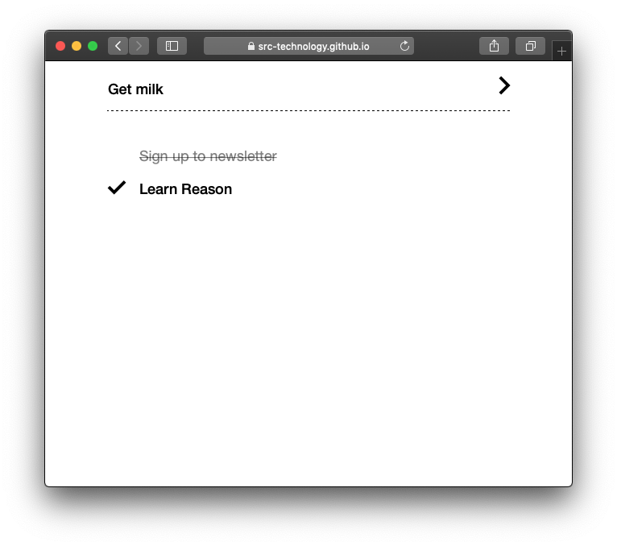

# Intro to Reason for Web

> **NOTE**: This is an early alpha of the course.

Hello and welcome to this Learning Lab on Reason where I will walk you through your first Reason project using ReasonReact. If you have used React.js before you should already know 90% of what you need — the course will help you out with the other 10%.

By the end of this course you will have:

🛠 An Editor, set up to work with Reason

🚀 A published ReasonReact ToDo application

